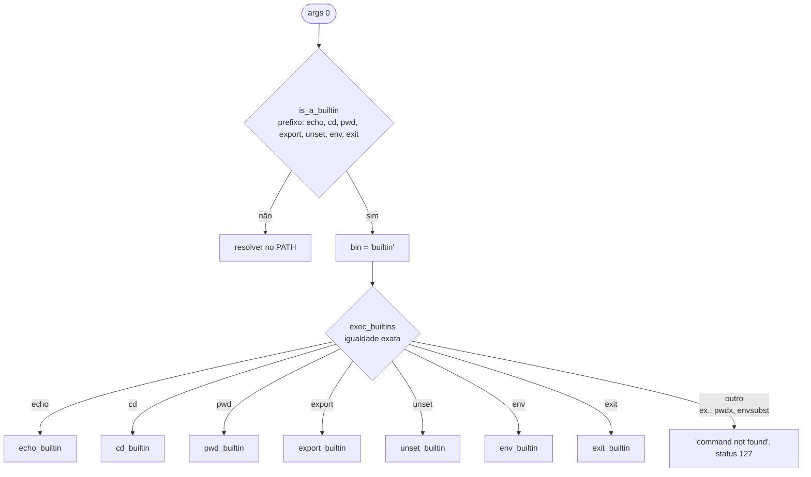
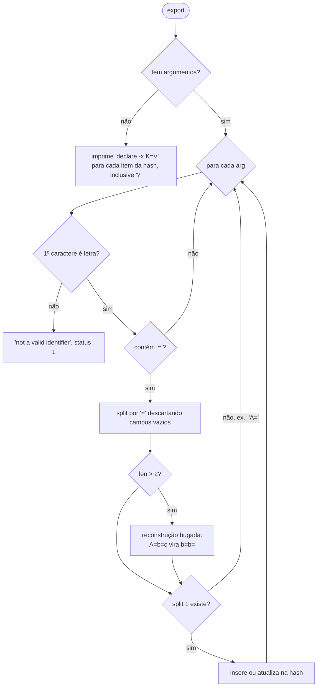
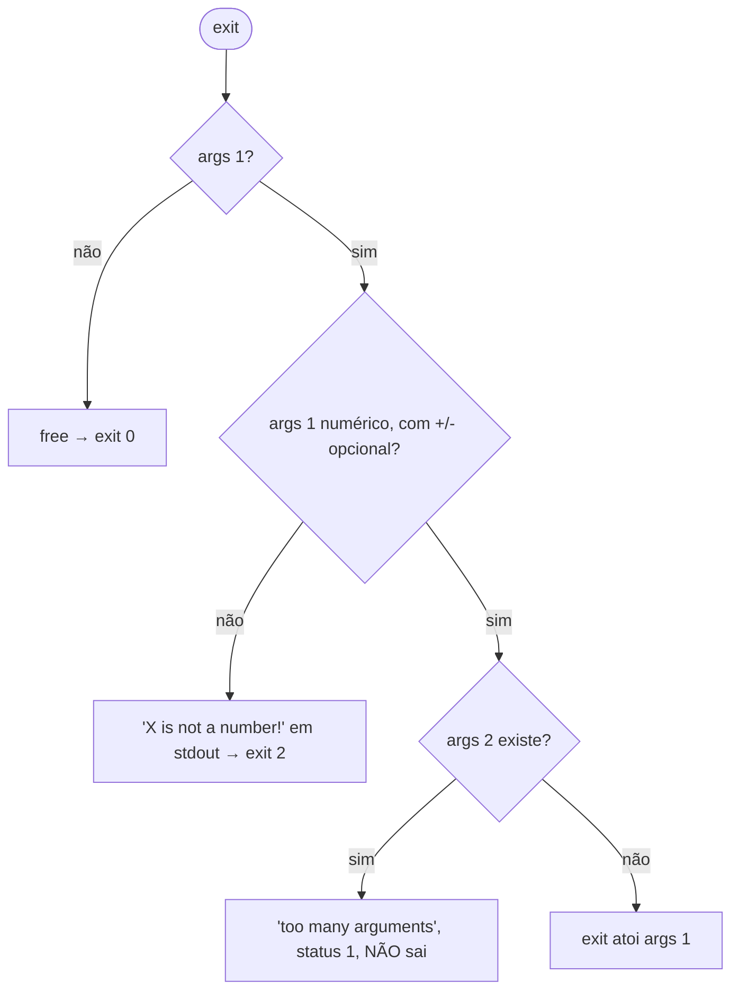

# Fluxograma: módulo `builtins`

> Arqueólogo · 2026-11-11 · 🟢 extraído de `src/builtins/*.c`

## Classificação e despacho

```mermaid
flowchart TD
    A([args 0]) --> B{is_a_builtin<br/>prefixo: echo, cd, pwd, export, unset, env, exit}
    B -- não --> C[resolver no PATH]
    B -- sim --> D[bin = 'builtin']
    D --> E{exec_builtins<br/>igualdade exata}
    E -- echo --> E1[echo_builtin]
    E -- cd --> E2[cd_builtin]
    E -- pwd --> E3[pwd_builtin]
    E -- export --> E4[export_builtin]
    E -- unset --> E5[unset_builtin]
    E -- env --> E6[env_builtin]
    E -- exit --> E7[exit_builtin]
    E -- outro<br/>ex.: pwdx, envsubst --> E8['command not found', status 127]
```

## `export`

```mermaid
flowchart TD
    A([export]) --> B{tem argumentos?}
    B -- não --> L[imprime 'declare -x K=V' para cada item da hash, inclusive '?']
    B -- sim --> C{para cada arg}
    C --> D{1º caractere é letra?}
    D -- não --> E['not a valid identifier', status 1]
    D -- sim --> F{contém '='?}
    F -- não --> C
    F -- sim --> G[split por '=' descartando campos vazios]
    G --> H{len > 2?}
    H -- sim --> H1[reconstrução bugada:<br/>A=b=c vira b=b=]
    H --> I{split 1 existe?}
    H1 --> I
    I -- não, ex.: 'A=' --> C
    I -- sim --> J[insere ou atualiza na hash] --> C
```

## `exit`

```mermaid
flowchart TD
    A([exit]) --> B{args 1?}
    B -- não --> Z[free → exit 0]
    B -- sim --> C{args 1 numérico, com +/- opcional?}
    C -- não --> D['X is not a number!' em stdout → exit 2]
    C -- sim --> E{args 2 existe?}
    E -- sim --> F['too many arguments', status 1, NÃO sai]
    E -- não --> G[exit atoi args 1]
```
