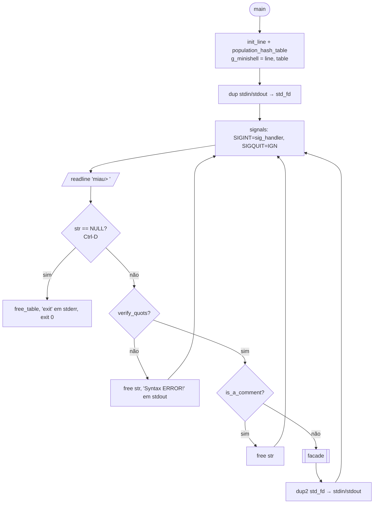
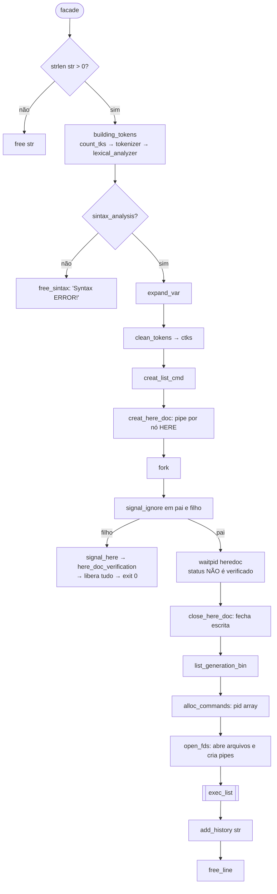

# Fluxograma: módulo `core`

> Arqueólogo · 2026-11-11 · 🟢 extraído de `src/main.c` e `src/facade.c`

## REPL (`main_loop`)

```mermaid
flowchart TD
    A([main]) --> B[init_line + population_hash_table<br/>g_minishell = line, table]
    B --> C[dup stdin/stdout → std_fd]
    C --> D[signals: SIGINT=sig_handler, SIGQUIT=IGN]
    D --> E[/readline 'miau> '/]
    E --> F{str == NULL?<br/>Ctrl-D}
    F -- sim --> G[free_table, 'exit' em stderr, exit 0]
    F -- não --> H{verify_quots?}
    H -- não --> I[free str, 'Syntax ERROR!' em stdout] --> D
    H -- sim --> J{is_a_comment?}
    J -- sim --> K[free str] --> D
    J -- não --> L[[facade]]
    L --> M[dup2 std_fd → stdin/stdout] --> D
```

## Facade (`facade` / `exec_pipe_line`)

```mermaid
flowchart TD
    A([facade]) --> B{strlen str > 0?}
    B -- não --> Z[free str]
    B -- sim --> C[building_tokens<br/>count_tks → tokenizer → lexical_analyzer]
    C --> D{sintax_analysis?}
    D -- não --> E[free_sintax: 'Syntax ERROR!']
    D -- sim --> F[expand_var]
    F --> G[clean_tokens → ctks]
    G --> H[creat_list_cmd]
    H --> I[creat_here_doc: pipe por nó HERE]
    I --> J[fork]
    J --> K[signal_ignore em pai e filho]
    K -->|filho| L[signal_here → here_doc_verification<br/>→ libera tudo → exit 0]
    K -->|pai| M[waitpid heredoc<br/>status NÃO é verificado]
    M --> N[close_here_doc: fecha escrita]
    N --> O[list_generation_bin]
    O --> P[alloc_commands: pid array]
    P --> Q[open_fds: abre arquivos e cria pipes]
    Q --> R[[exec_list]]
    R --> S[add_history str]
    S --> T[free_line]
```
