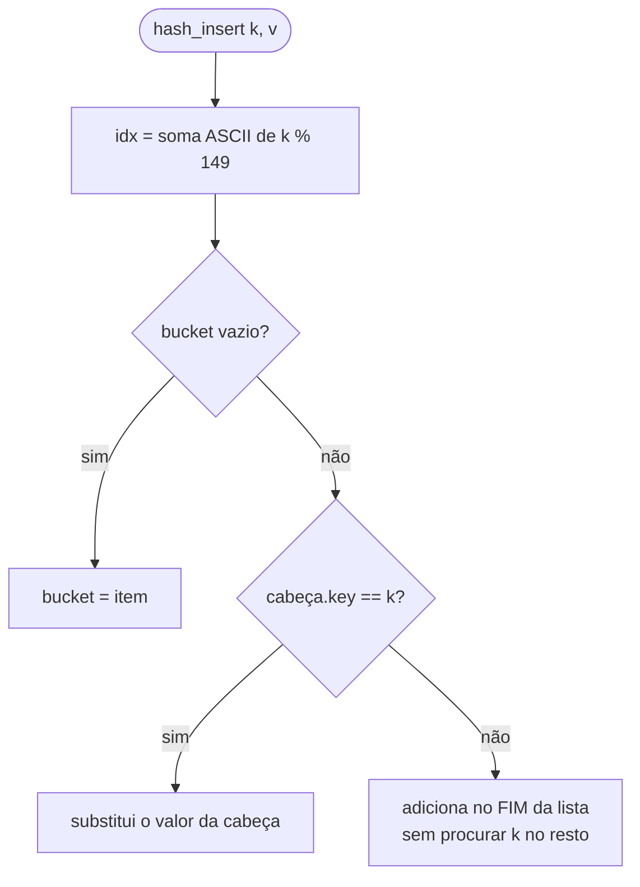
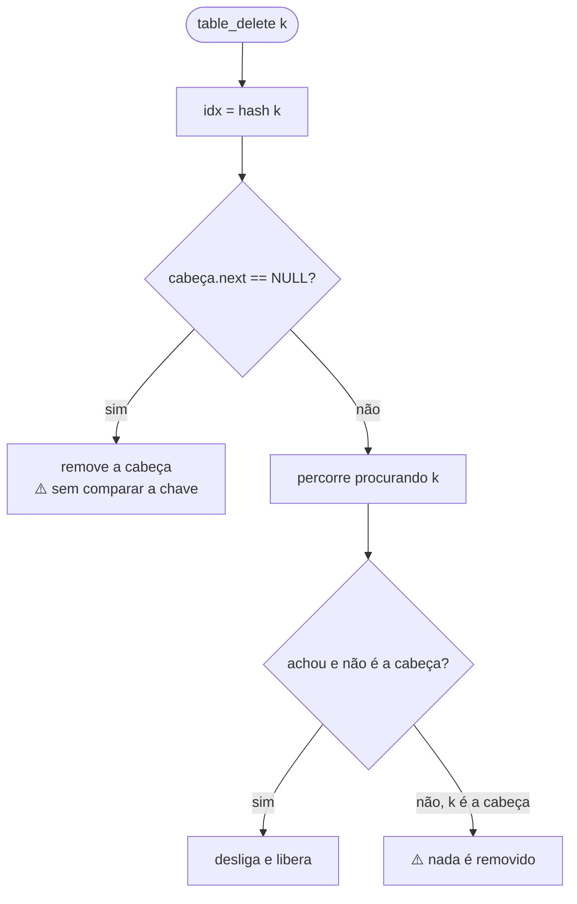
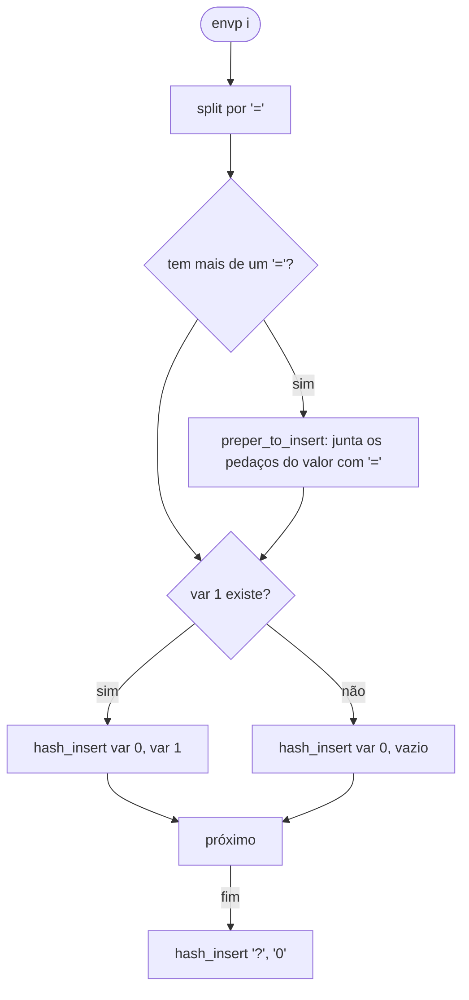

# Fluxograma: módulo `hash_table`

> Arqueólogo · 2026-11-11 · 🟢 extraído de `src/hash_table/*.c`

## Inserção

```mermaid
flowchart TD
    A([hash_insert k, v]) --> B[idx = soma ASCII de k % 149]
    B --> C{bucket vazio?}
    C -- sim --> D[bucket = item]
    C -- não --> E{cabeça.key == k?}
    E -- sim --> F[substitui o valor da cabeça]
    E -- não --> G[adiciona no FIM da lista<br/>sem procurar k no resto]
```

## Remoção

```mermaid
flowchart TD
    A([table_delete k]) --> B[idx = hash k]
    B --> C{cabeça.next == NULL?}
    C -- sim --> D[remove a cabeça<br/>⚠️ sem comparar a chave]
    C -- não --> E[percorre procurando k]
    E --> F{achou e não é a cabeça?}
    F -- sim --> G[desliga e libera]
    F -- não, k é a cabeça --> H[⚠️ nada é removido]
```

## Carga inicial

```mermaid
flowchart TD
    A([envp i]) --> B[split por '=']
    B --> C{tem mais de um '='?}
    C -- sim --> D[preper_to_insert: junta os pedaços do valor com '=']
    C --> E{var 1 existe?}
    D --> E
    E -- sim --> F[hash_insert var 0, var 1]
    E -- não --> G[hash_insert var 0, vazio]
    F --> H[próximo]
    G --> H
    H -- fim --> I[hash_insert '?', '0']
```
